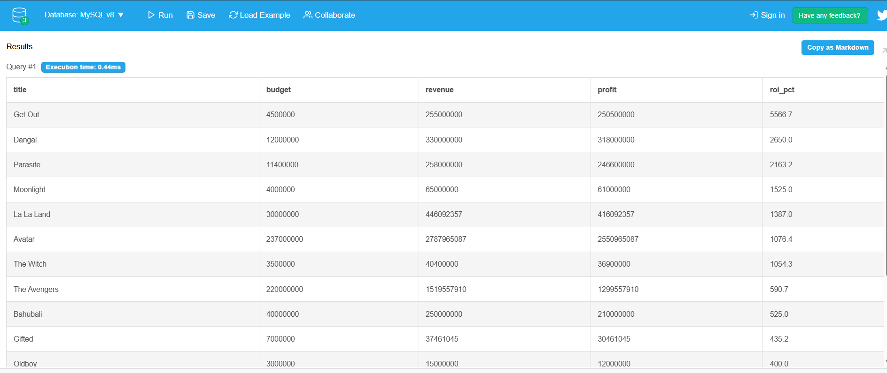
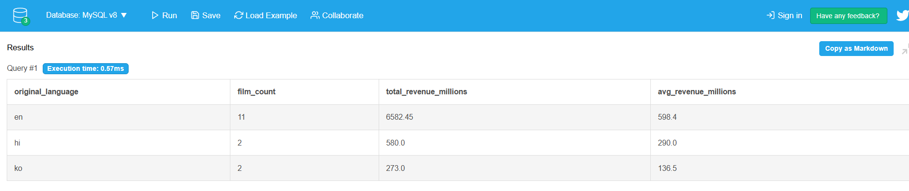
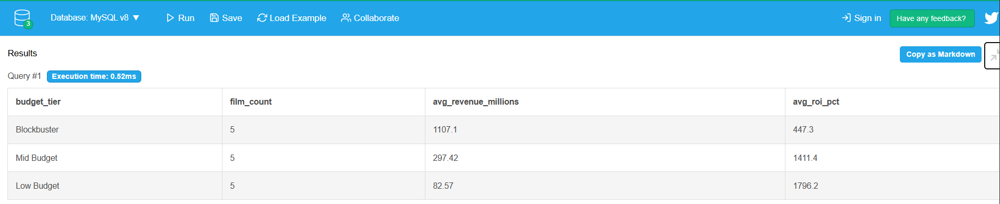

# Movie Database SQL Analysis

**Tool:** SQL (MySQL-compatible)  
**Dataset:** 4,535 films from the Cisco NetAcad Movies dataset (2000–2017)  
**Course:** Data Analytics Essentials — Cisco Networking Academy  

## What This Project Does
11 SQL queries analysing box office performance across revenue, ROI, language, 
budget tier, runtime and audience ratings.

## Queries Included
1. Dataset overview and date range
2. Top 10 highest-grossing films
3. Top 10 films by ROI
4. Annual revenue trends (2000–2017)
5. Revenue by original language
6. Budget tier analysis using CASE WHEN
7. Critical and commercial success (dual subqueries)
8. Popularity banding
9. Runtime vs revenue relationship
10. Most profitable years
11. English vs non-English language comparison

## Key Findings
- Blockbuster films (>$80M budget) generate the highest average revenue 
  but mid-budget films ($5–20M) show the most consistent ROI
- English-language films account for 81% of films but only 
  dominate revenue — non-English films show competitive average ROI
- 2015–2016 were the peak years by total profit

## Skills Demonstrated
SELECT, WHERE, GROUP BY, HAVING, ORDER BY, CASE WHEN, 
Subqueries, Derived Table JOINs, Aggregate Functions

## Query output screenshots

**Query 1 — Top films by ROI:**

**Query 2 — Revenue by language:**

**Query 3 — Budget tier analysis:**

